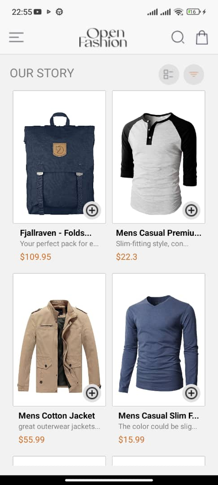
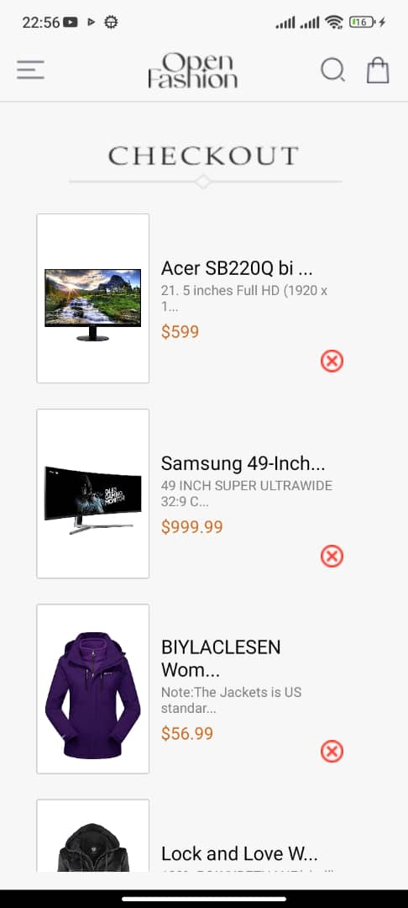
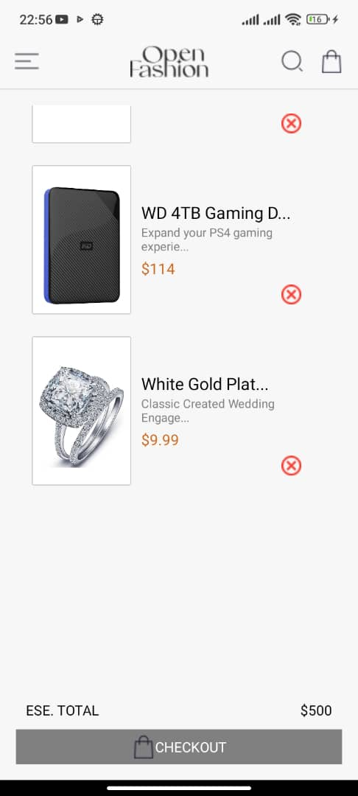
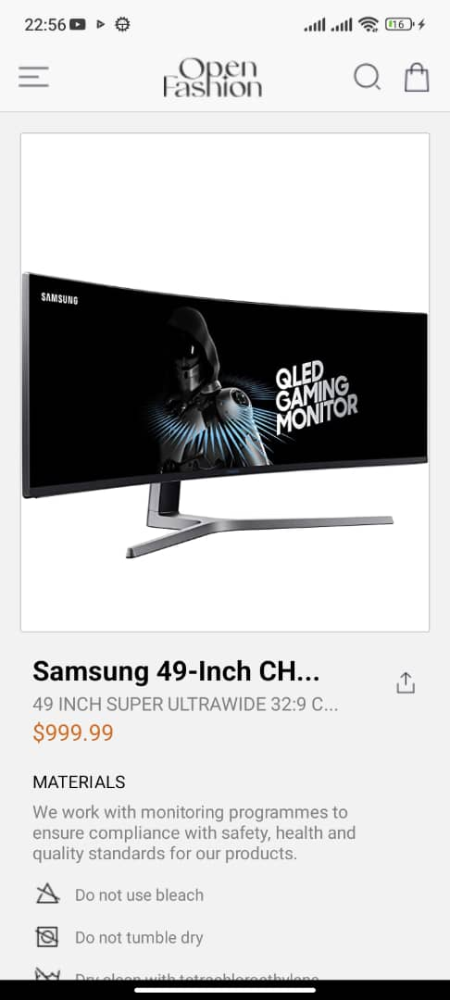
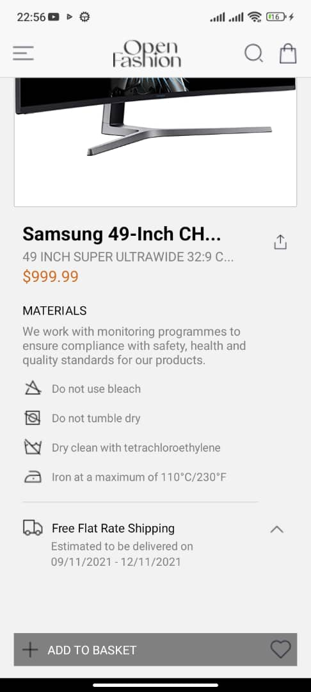
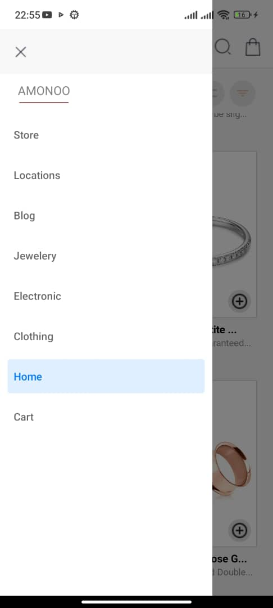

# Expo App README

## Design Choices

- The app uses a DrawerNavigator from React Navigation to navigate between screens.
- The CartContext is used to manage the cart state and provide it to the components that need it.
- The app uses AsyncStorage to store the cart items locally on the device.

## Data Storage

- The cart items are stored locally on the device using AsyncStorage.
- The cart items are retrieved from AsyncStorage when the app starts and stored back in AsyncStorage when the cart is updated.

## Screenshots

### Home Screen

### Cart Screen

### Product Detail Screen

### Drawer Content

## Getting Started

- Install the dependencies by running npm install
- Start the app by running npm start
- Open the app in the Expo client

## Features

- Browse products on the home screen
- Add products to the cart
- View cart and remove items
- View product details

## Components

- CartContext: manages the cart state
- CartProvider: provides the cart state to the components
- DrawerNavigator: navigates between screens
- HomeScreen: displays the list of products
- CartScreen: displays the cart items
- ProductDetailScreen: displays the product details